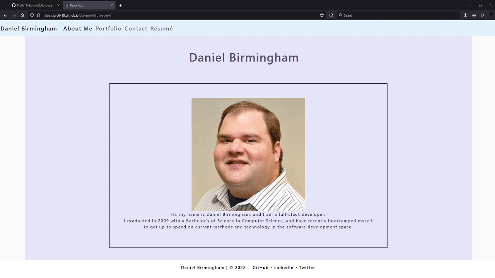

# Portfolio Page

[](https://opensource.org/licenses/MIT)

## Description
This application is my personal portfolio webpage. Users are able to view information about me, six portfolio entries, a contact form that has input validation, and a résumé page. The footer also features links to my social accounts.

This is a React app written with HTML, CSS, JavaScript, and JSX, and is publicly deployed on GitHub Pages.



## Table of Contents
- [Link to Deployed Application](#link-to-deployed-application)
- [User Story](#user-story)
- [Installation](#installation)
- [Usage](#usage)
- [Tests](#tests)
- [Author](#author)
- [License](#license)
- [Contributing](#contributing)
- [Questions](#questions)

## Link to Deployed Application

[https://prolix19.github.io/dtb-portfolio-page/](https://prolix19.github.io/dtb-portfolio-page/)

## User Story
This Portfolio Page application was created to meet the requirements of the following user story:
```
AS AN employer looking for candidates with experience building single-page applications
I WANT to view a potential employee's deployed React portfolio of work samples
SO THAT I can assess whether they're a good candidate for an open position
```

## Installation
If you would like to run the webpage locally instead of visiting the deployed application, follow these steps:

 1. Clone the repository, or download and extract an archive of it
 2. Run "npm install" to obtain the required dependencies

## Usage
 1. Invoke the app with "npm start" or "react-scripts start"
 2. Visit http://localhost:3000/dtb-portfolio-page/ to begin browsing the website

## Tests
There is no test suite included with this application.

## Author
Application written by Daniel Birmingham ([GitHub profile](https://github.com/Prolix19/)).

## License
[The MIT License](https://opensource.org/licenses/MIT)

## Contributing
This project is not open to contributions at this time.

## Questions
You may reach me via any of the social links featured on my portfolion page with any additional questions you may have.